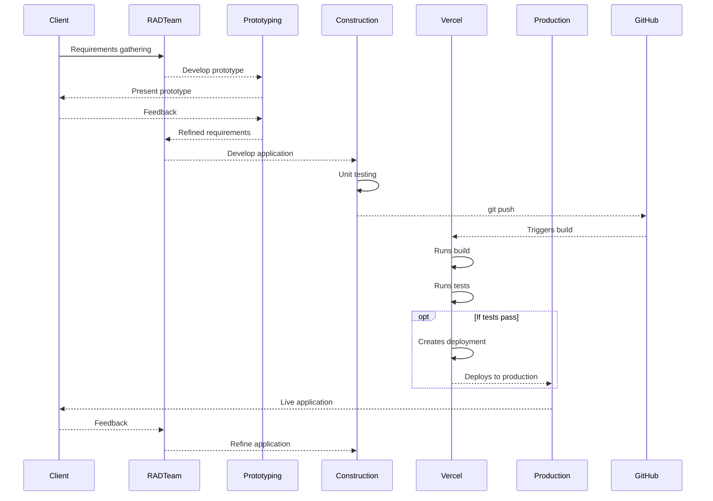
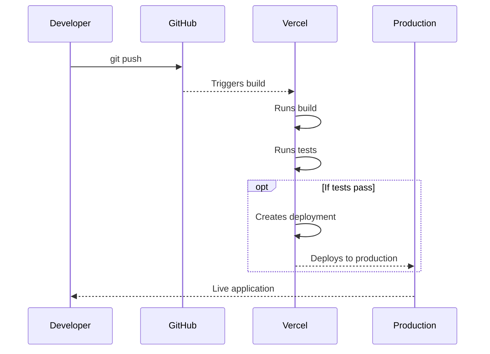
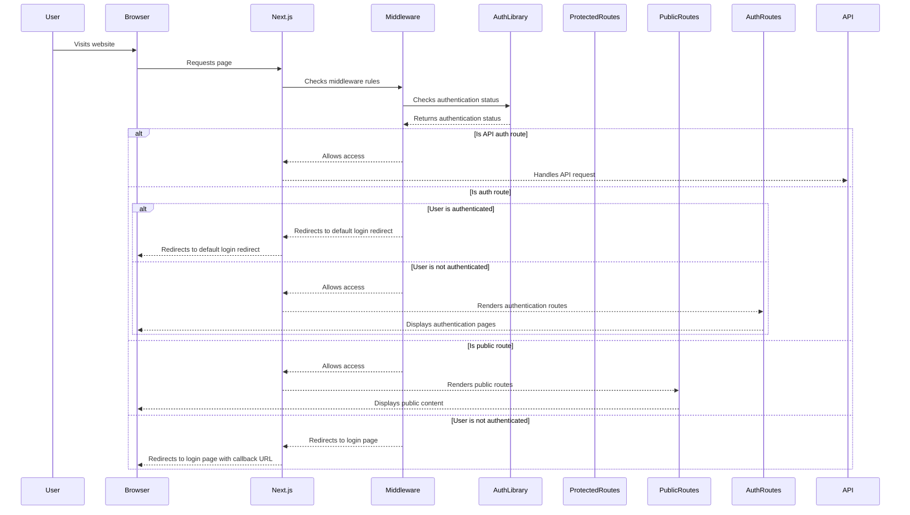

# DewaMin

"admin dashboard tailored for ...."

## CI/CD

Developed using RAD method with vercel's deployment flow

### Developtment Process Using RAD



### Deployment using Vercel



## Dependencies

#### Authentication and Database

- `@auth/prisma-adapter`: Provides a Prisma adapter for NextAuth.js, enabling easy integration with Prisma for authentication.
- `@prisma/client`: The Prisma client library for interacting with the database.
- `next-auth`: Authentication library for Next.js applications.
- `bcrypt`: A library for hashing passwords.

#### React Libraries and UI Components

- `@tanstack/react-table`: A powerful and lightweight table library for React.
- `@radix-ui/react-*`: A collection of accessible and customizable React UI components.
- `clsx`: A utility for constructing `className` strings conditionally.
- `cmdk`: A command menu/palette for React applications.
- `lucide-react`: A collection of React icons based on the Lucide icon library.
- `react-hook-form`: A library for building forms with React hooks.
- `recharts`: A popular charting library for React.
- `tailwind-merge`: A utility for merging Tailwind CSS classes with other classes.
- `tailwindcss-animate`: Adds animation utilities to Tailwind CSS.

#### Utility Libraries

- `class-variance-authority`: A library for managing design tokens and generating utility classes.
- `uuid`: A library for generating unique identifiers.
- `zod`: A TypeScript-first schema validation library.

#### Miscellaneous

- `@hookform/resolvers`: Provides resolvers for react-hook-form to integrate with other libraries like Zod or Yup.
- `input-otp`: A library for building OTP input fields.
- `resend`: A library for resending verification codes.
- `sonner`: A library for playing sounds and notifications.

## System flow

#### Authentification



# Folder Structure

```bash
dewamin(root)
│   .env
│   .eslintrc.json
│   .gitignore
│   components.json
│   next-auth.d.ts
│   next-env.d.ts
│   next.config.mjs
│   package-lock.json
│   package.json
│   postcss.config.js
│   README.md
│   tailwind.config.ts
│   tsconfig.json
├───prisma
├───public
└───src
    │   middleware.ts
    │   routes.ts
    ├───app
    │   │   favicon.ico
    │   │   globals.css
    │   │   layout.tsx
    │   │   loading.tsx
    │   │   not-found.tsx
    │   │   page.tsx
    │   ├───(main)
    │   ├───api
    │   └───auth
    ├───components
    ├───data
    ├───hooks
    ├───lib
    ├───schemas
    ├───server-actions
    └───types
```
